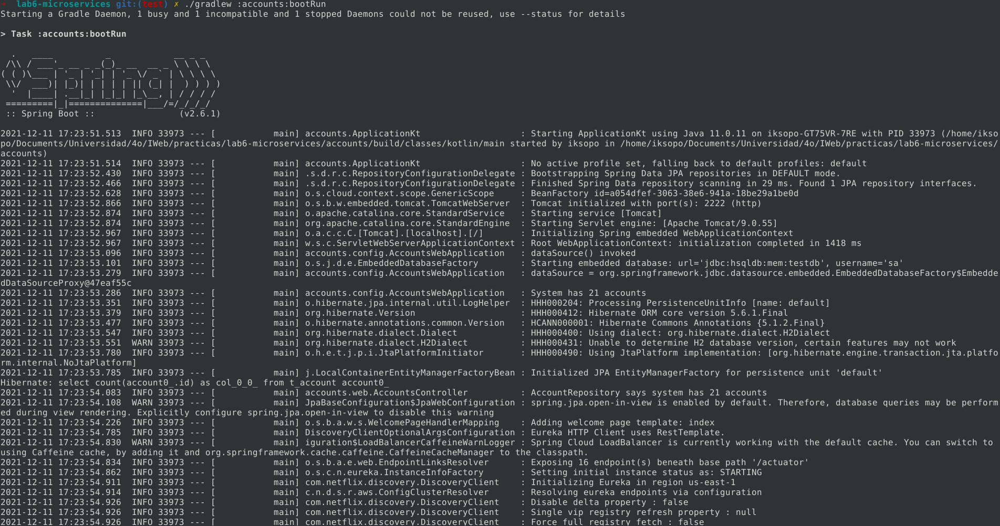
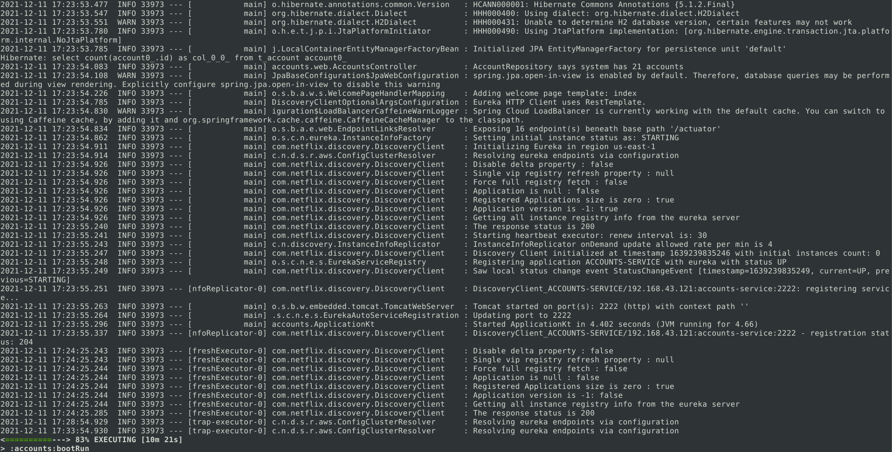
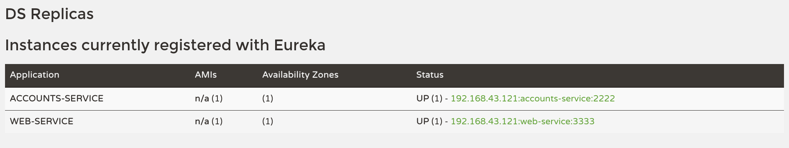
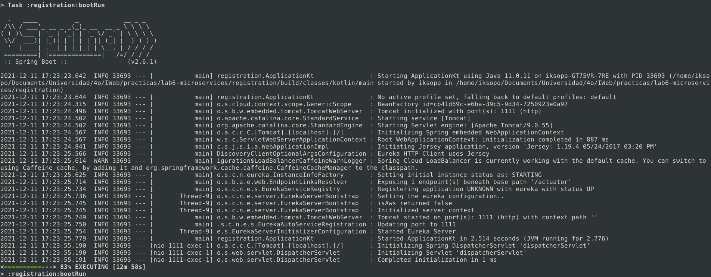
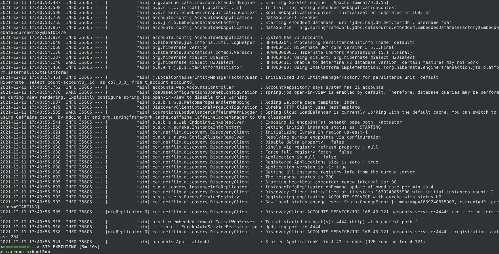
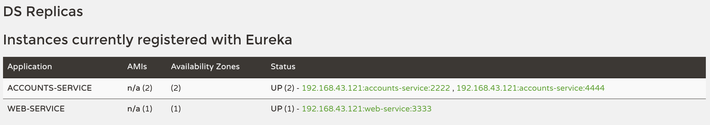
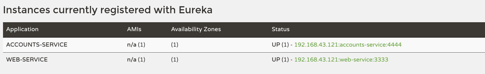
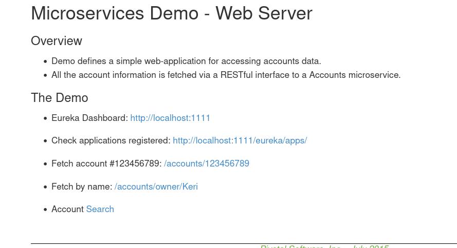
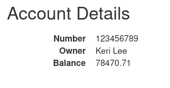
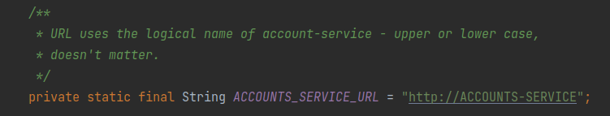

# Solution
## The two services are running and registered 
To run and register the services, run them executing the following commands:
```
./gradlew :registration:bootRun
./gradlew :accounts:bootRun
./gradlew :web:bootRun
```


The logs produced are the following:
- Accounts
  
  
- Web
  

Screenshots show they are initialized and resolving eureka endpoints via configuration.
Also each service is getting registered in Eureka.
## The service registration service has the two services registered

Now after a short period of time they will be registered in Eureka:


It produces the following log (doesn't log anything about registered services):


Now both services are registered in Eureka and appear correctly in the dashboard.
## A second account service is running in the port 4444 and it is registered
In `accounts/src/resources/application.yml`, change `port:2222` to `port:4444` in order to boot
a second account service there.

It successfully registers in Eureka:



As it is shown, there are 2 `ACCOUNTS_SERVICE` available.

## What happens when you kill the service with port 2222. Can the web service provide information about the accounts? Why?

After killing the account service in 2222, the corresponding service disappears from Eureka:


It takes some time to reconfigure. After that, you can ask information to the web service about
the accounts without producing any `500: Internal Server Error` (it is caused while Eureka still redirects to the dead
service until it realises it is down).

This is what happens when asking for an account:



It works because when the web server is asked for an account, it asks Eureka for where is the account
service located. The web server doesn't have a direct route to the account server, it has a logic one
and Eureka translates it to the real one.

